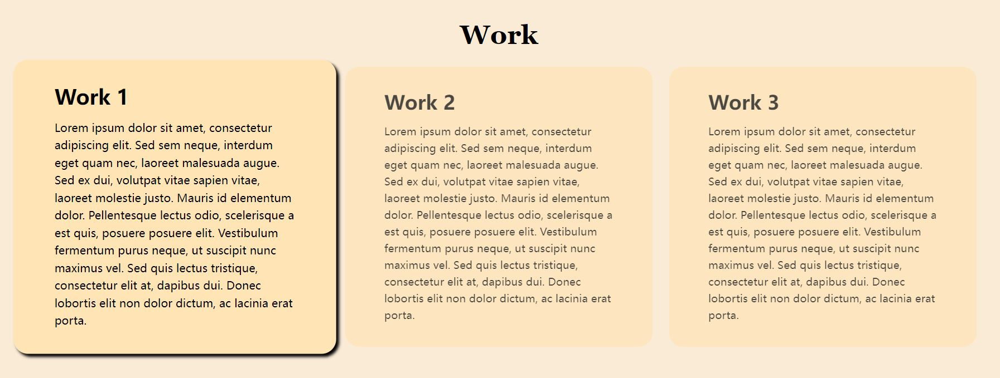

# Personal-Portfolio

## Description

This page is a personal portfolio for Haozhe Huang, including three sections: About Me, Work and Contact Me.

## Installation

N/A

## Usage

To use this personal portfolio, you can review the navigation bar on the top right, the image is shown below:  this will direct the page to correspoding section. The page contains 3 main parts, the About Me section is shown below the nav bar. 
The next is the work section, image is shown below:  the four sections is shown now, only four is shown at this moment, more work can be added on in the future. The work application box can be clicked on and there are some visual effect when you hover over it. 
And the Contact Me section is ont he bottom, imgae is shown below:  corresponding links can be added later on.

## Credits

N/A

## License

MIT License

## Website
The URL is shown below:
https://haozhe-h.github.io/Personal-Portfolio/
